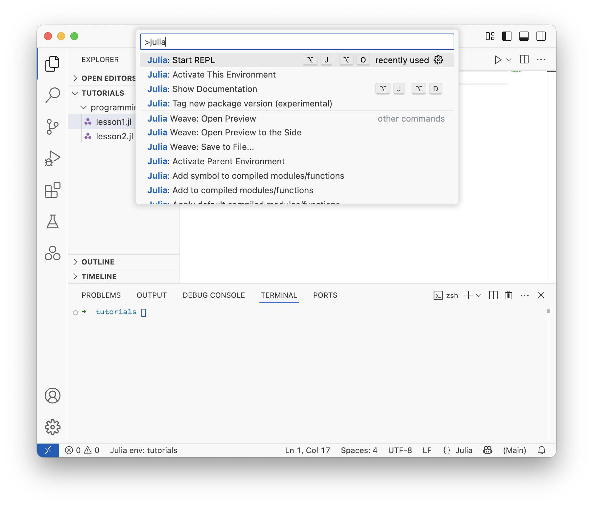
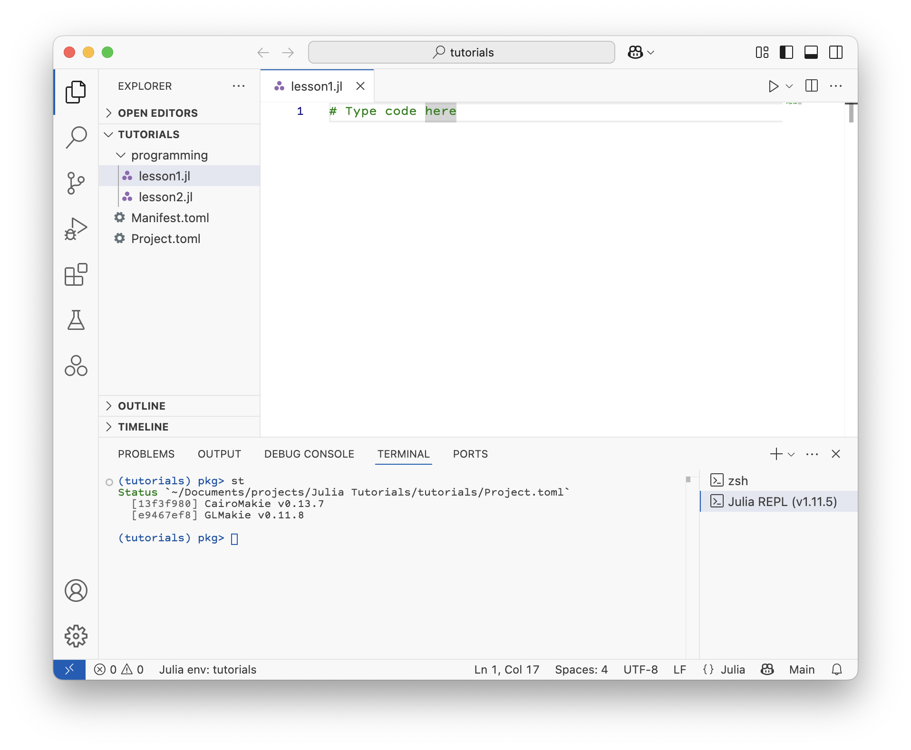

# Introduction

This tutorial is designed to introduce students to the Julia programming language and its applications in spectroscopy.
Lessons are more like lecture notes.
It is intended for students who have never programmed before, or who have only done a little programming in another language. The goal is to teach the basics of programming in Julia, and to provide examples of how to use Julia for data analysis and visualization in spectroscopy.
It is not intended to be a comprehensive introduction to Julia, but rather a starting point for students to learn how to use Julia for their own research projects in spectroscopy.

## Getting started

### What is Julia?
The [Julia programming language](https://en.wikipedia.org/wiki/Julia_(programming_language)) is a high-level, general purpose programming language designed for high-performance numerical and scientific computing.
It is by default a [just-in-time](https://en.wikipedia.org/wiki/Just-in-time_compilation) (JIT) compiled language, meaning that it compiles code as you need it.

The Julia community is small, but it has found a niche in scientific computing.
It is used by CERN to analyze data from the Large Hadron Collider, and by the NASA Jet Propulsion Laboratory for modeling spacecraft and data analysis.
It is also used by many pharmaceutical companies for drug discovery and development.


### Why use Julia?
There are a lot of software options that can be used to analyze data.
Why even learn a programming language?
First, programming languages are much more powerful than GUI based programs or spreadsheets.
They allow you to automate repetitive tasks, and to write code that can be reused in different contexts.
They also allow custom analytical solutions to be developed, and to be shared with others.
Programming languages are also much more flexible than GUI based programs or spreadsheets.
I choose the Julia programming language in particular for several reasons:

1. It was designed numerical and scientific computing from the start and has a robust collection of scientific libraries.
2. It is easy to learn, borrowing good ideas from Python, Lisp, and others.
3. It is responsive and interactive. It can be used in Jupyter notebooks or in the REPL (Read Evaluate Print Loop) in the command line. The VS Code extension for Julia also provides an interactive environment for writing and running code.
4. It uses modern technologies (JIT and LLVM) and was designed for performance from the start. It is fast, comparable to C or Fortran. So if performance is your goal, you can stick with Julia and do not need to learn a second language.
5. Scientific software can be very expensive. Julia is free, open source, and has a [helpful community](https://discourse.julialang.org).
6. Reproducibiliy is a priority, and Julia has a built-in package management system that makes it easy to share code and reproduce results. This is essential when designing code for science.
7. I was sold on the excellent plotting library, Makie.jl. It is fast, interactive, and has a clean API.

### What is Visual Studio Code?
[Visual Studio Code](https://code.visualstudio.com/) (VS Code) is a free, open source code editor developed by Microsoft.
It is a lightweight, cross-platform code editor that supports many programming languages, including Julia.
We won't cover all of the features of VS Code, but I encourage you to explore it on your own and check out the [documentation](https://code.visualstudio.com/docs/) for videos and tutorials.
There are also language-specific tutorials available, including for using [Julia in VS Code](https://code.visualstudio.com/docs/languages/julia).


### Install Julia and Visual Studio Code
1. Install the latest version of Julia following the instructions on the [official website](https://julialang.org/install/).
2. Download and install [Visual Studio Code](https://code.visualstudio.com/).
3. Install the Julia extension for Visual Studio Code by searching for "Julia" in the [Extensions Marketplace](https://marketplace.visualstudio.com/items?itemName=julialang.language-julia).

We will first use the Julia REPL (Read-Eval-Print Loop) in the terminal. VS Code will be used later.
There are many code editors available, but we will use VS Code because it is free and widely used for many programming languages.


#### The Command Palette
Briefly explain [the command palette](https://code.visualstudio.com/docs/getstarted/userinterface#_command-palette) and how to use it in VS Code.


### Exercises
1. Open the Julia REPL in the terminal by typing `julia` in the terminal.
2. Type `versioninfo()` in the REPL to check that Julia is installed correctly.
3. Your first program in Julia: type `print("Hello, world!")` in the REPL to print "Hello, world!" to the console.


## Files, folders, and environments
The concept of files and folders are reviewed and then a tour of Visual Studio Code is given.
Students create a project folder to store their tutorial files and future experiment code.
This ensures consistent data storage and analysis practices in the lab.
We also cover environments and how to create a new environment for each project.
This is important for reproducibility and to avoid package conflicts.

To the instructor: Do not show your actual experiments folder, unless it is *very* well organized (to avoid confusion). Follow along with these instructions with the students.


### Files and folders on a computer
On a computer, files are stored in folders (directories), where a folder can contain both files and other folders.
We want to store files and folders in a way that makes it easy to find things later and to make it easy to write and read complex code.
It is important in science to have well-organized data and code for reproducibility.

Follow these steps to create a project folder for your tutorials and experiments:

1. On macOS, go to `~/Documents/` and create a new folder called `projects`. On Windows go to `C:\Users\<username>\Documents\` and create a new folder called `projects`. This is where you will store your projects while you are in the lab.

2. Inside of `projects`, create a new folder called `tutorials`. This is where you will store code for these tutorials. (You make other folders for you main experiments later in `projects`.)

3. Open Visual Studio Code and open the `tutorials` folder that you just created (click File, then Open Folder... from the menu). This folder will be used for all tutorials, including analysis in the optics tutorials later.

4. Click on the new folder icon and make a new folder called `programming` or something similar. This is where you will store code and homework for the programming tutorial.

5. Create a new file for the next lesson in the `programming` folder called `variables.jl` or `lesson1.jl` or anything you like.

Here is the structure of your `tutorials` folder so far:

```
projects
└── tutorials
    └── programming
        └── variables.jl
```

In the future, you might have a couple of projects and you might have a structure like this:

```
projects
├── tutorials
│   └── programming
│       └── variables.jl
└── experiments
    ├── FTIR
    │   ├── data
    │   └── analysis.jl
    └── NMR
        ├── data
        └── analysis.jl
```

The exact structure is up to you, but it is important to have a consistent structure for your projects so that you can find things later and so that others can understand your code and analysis.


### Environments
Now that you have a project folder, let's set up an environment for this project.
In Julia, an environment is a collection of packages and their versions that are used for a specific project.
This is important for reproducibility and to avoid package conflicts.
If you do not use environments you may end up with many packages installed that you do not need, and you may have conflicts between different versions of packages.
Then you will have to spend time debugging and fixing these issues, which is not fun.
In Julia, you can use the package manager to create and manage environments.
We will create an environment for the `tutorials` folder that you created previously.
When you start your experiments, you will create a new environment in a different folder for each project.

First look in the bottom left corner of the Visual Studio Code window.
Notice that it say "Julia env: v1.11" or something similar.
The first part, "Julia env:", indicates that you are in a Julia environment.
The second part, "v1.11", indicates the version of Julia you are using.
This means that you are using the default Julia environment, which is the global environment.
In general, we don't want to use the global environment for our projects.
Sometimes I use the global environment for quick tests, but I always create a new folder and environment for my projects.

Let's create an environment for the `tutorials` folder that you made in the previous section.
If it is not already open, open the `tutorials` folder in Visual Studio Code.
Then let's create a new environment here, following these steps:
1. Open the Julia REPL in Visual Studio Code via the Command Palette (Ctrl+Shift+P) and find `Julia: Start REPL`.


2. In the REPL, type `]` to enter the package manager mode.
Notice that here too, it says `(@v1.11) pkg>` or similar, indicating that you are in the global environment.
3. Type `activate .` to create a new environment in the current folder. (The `.` means the current folder.)
Now it says `(tutorials) pkg>`, indicating that you are in the new environment.
4. Now let's add the plotting package that we will use later, `GLMakie` and `CairoMakie`. I will explain what these are when we start to use them.

Two new files were just created in the `tutorials` folder: `Project.toml` and `Manifest.toml`.
These files contain information about the packages and their versions that are used in this environment.
This is how Julia keeps track of the exact versions of the packages you are using and ensures that your code will work in the future.
This is important for reproducibility and sharing code with other researchers.

In the future, when you open this folder in Visual Studio Code, it will automatically activate this environment.
Let's try that now.
Close and reopen VS Code.
The environment indicator in the lower left will say "Julia env: tutorials" instead of "Julia env: v1.11".
If it does not, click on the environment indicator and select the `tutorials` environment from the drop down list that appears at the top of the VS Code window.

When Makie and its dependencies have finished installing and compiling, you can type `status` or `st` in the package manager mode to see the list of packages that are installed in this environment.

Below is what your environment and file structure should look like after setup.




### Exercises
1. Download the Japanese language extension for VS Code.
2. Find the setting to change the VS Code theme from the command palette.
3. Try to open a folder from the command palette.


## Problems
1. In your `tutorials` folder, create a file called "hello_world.jl" and type `println("Hello, world!")` in the file. Hit Shift+Enter to run this line of code.
2. Check out the Julia documentation at [docs.julialang.org](https://docs.julialang.org/). What kinds of things can you find there?
