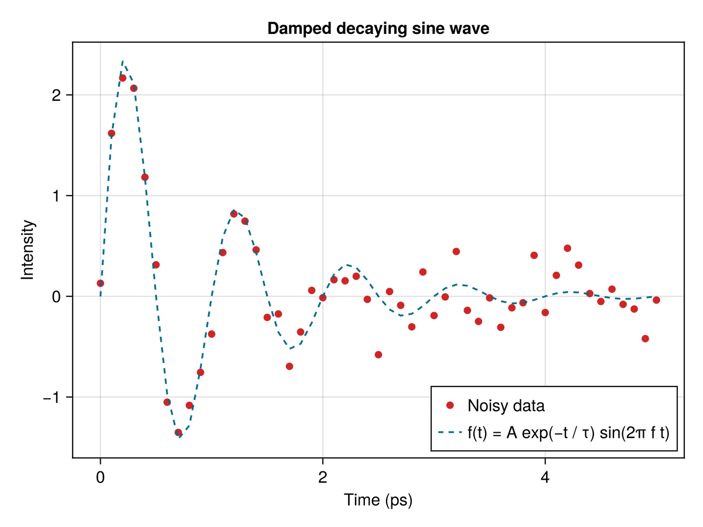

# Plotting

All of the functions we have used so far have been part of the Julia standard library.
In this lesson we will use our first external package: a plotting library called [Makie.jl](https://makie.org).

Makie.jl is a powerful, modern plotting library that is easy to use and produces high-quality visualizations.
It has a GPU-accelerated backend for fast rendering and interactive plots, a static vector graphics backend for high-quality publication-ready plots, and a web-based backend for interactive plots in the browser.
 
Check out the official [Makie tutorials](https://docs.makie.org/stable/tutorials/getting-started) for examples and documentation.


## Before we start
Makie's [Getting Started](https://docs.makie.org/stable/tutorials/getting-started) tutorial is very well written and, honestly, I can't do much better for an introduction.
Before this lesson, please go through it on your own and ask questions if you run into trouble.

As a reminder, here is how to install Makie (or any package) on your system.


### Install Makie
There are three backends for Makie:
- **GLMakie:** a GPU-accelerated backend for fast rendering and interactive plots.
- **CairoMakie:** a static vector graphics backend for high-quality publication-ready plots.
- **WGLMakie:** a web-based backend for interactive plots in the browser.

In this tutorial we will use GLMakie in VS Code, but you can also use CairoMakie.
Let's first install it.

1. Open the Julia REPL in VS Code via the Command Palette (`Cmd+Shift+P` on macOS) (`Ctrl+Shift+P` on Windows) and type `Julia: Start REPL`.
2. In the REPL, type `]` to enter the package manager. (Hit backspace to exit the package manager and return to the Julia REPL.)
3. Check that the current environment is set to the current directory. If not, type `activate .` to create a new environment in the current folder.
4. You can see what packages are installed by typing `status` in the package manager (`st` is a shortcut).
5. Type `add GLMakie` (or `CairoMakie`) to install.
6. Make a new file called `plotting.jl` in your tutorial folder.
7. Type `using GLMakie` inside the file at the top
8. Evaluate the line (`shift+enter`) to load the package.


## Make a basic plot
Let's first define a function: a damped sine wave as a function of time.

```julia
function damped_sine(t, A, f, τ)
    return A * exp(-t / τ) * sin(2π * f * t)
end
```

Then we will generate the data.
Start with the following values

```julia
A = 3.0  # amplitude
f = 1  # frequency in Hz
τ = 1  # decay time constant in seconds
```

Create the `seconds` values any way you like.
Then generate the intensity values and store them in a variable called `intensity`.

```julia
seconds = 1:0.1:5
intensity = damped_sine.(t, A, f, τ)
```

Let's add a bit of noise to the data to make it look more realistic.

```julia
# Add some noise to the data
noise = 0.1 * randn(length(seconds))
intensity_noisy = intensity .+ noise
```

In Makie, the `Figure` is the top-level container object.
An `Axis` is a container object for plots.
We can place one or more `Axis` objects in a `Figure` to create a layout.
Let's try this step by step in VS Code.

```julia
using GLMakie

f = Figure()
f
```

Hit `alt+enter` to run all of the code in this file. You should see a blank figure window pop up.
The code might run slow at first.
This is because Julia is a just-in-time (JIT) compiled language, meaning that it compiles code as you need it.
The first time you run the code, it will take a bit longer to run.
But subsequent runs will be much faster.

Think of a `Figure` as a blank canvas on which to place axes, plots, and labels.
Now let's add an `Axis` to the figure.

```julia
f = Figure()
ax = Axis(f[1, 1])
f
```

The `Axis` function has many options to customize the plot, such as the title, labels, and limits.
Let's make another `Axis` in the first row and second column of the figure.

```julia
f = Figure()
ax = Axis(f[1, 1])
ax2 = Axis(f[1, 2])
f
```

An `Axis` can span multiple rows and columns.

```julia
f = Figure()
ax = Axis(f[1, 1])
ax2 = Axis(f[1, 2])
ax3 = Axis(f[2, 1:2])
f
```

We can also change the size of the figure.

```julia
f = Figure(size = (800, 800))
```

These are just the basics of the powerful layout system in Makie.
For now, let's just create a single `Axis` in the figure and plot our noisy data.

```julia
f = Figure()
ax = Axis(f[1, 1],
    title = "Damped sine wave",
    xlabel = "Time (s)",
    ylabel = "Intensity",
)
scatter!(
    seconds,
    intensity_noisy,
    color = :firebrick3
    label = "Data",
    )
lines!(
    seconds,
    intensity,
    color = :deepskyblue4,
    linestyle = :dash,
    label = "f(x) = A exp(−t / τ) sin(2π f t)",
    )

axislegend(position = :rb)
f
```



If the plot comes after the `Axis` definition, it will be drawn on top of the `Axis` and you don't need to input the `ax` variable.
These are some colors that I like.
There is a full color palette at [Colors.jl](https://juliagraphics.github.io/Colors.jl/latest/namedcolors/).


### Navigating a plot
You can zoom in and out of the plot by scrolling.
Click while holding the `ctrl` key to reset the zoom.
Holding `x` or `y` while scrolling will zoom in only on the x or y axis.
Click and drag to zoom in a rectangle.
This can also be done in x or y direction by holding `x` or `y` while dragging.


## Commenting and working in sections in VS Code
By now you know that you can evaluate a single line of code by placing the cursor on the line and hitting `shift+enter`.
You can also evaluate the entire file by pressing `alt+enter`.

It's common to also leave comments in the code to explain what the code does.
You can add comments by starting a line with `#` or by adding `#` at the end of a line.
A convenient way to comment out a line is to select the line and hit `cmd+/` (or `ctrl+/` on Windows).
Hit `cmd+/` (`ctrl+/`) again to uncomment the line.

Try this by changing the `markersize` to `10` toggling the comment keyboard shortcut.

```julia
scatter!(
    seconds,
    intensity_noisy,
    color = :firebrick3
    label = "Data",
    # markersize = 10,
)
```

Sometimes you want to evaluate only a section of the code.
For example, you might want to evaluate the code that generates the data and the code that creates the plot separately.
You can separate chunks of code by adding `##` at the beginning of line.
Then hitting `alt+enter` will evaluate the code in that section (between two `##` lines, or from the beginning of the file to the first `##` or from the last `##` to the end of the file).
Try this by separating the code that generates the data and the code that creates the plot into two sections.

Modify the parameters of the function until you obtain a plot that looks something like this:


## Saving
You can save the plot to a file using the `save` function.

You can save the plot to a file using the `save` function.
Save this plot to a file called `damped_sine_wave.png` in a new folder called `output` in your tutorial folder.

```julia
save("output/damped_sine_wave.png", f)
```

Notice that the plot no longer appears in the window.
You can comment out the `save` line and evaluate again to see the plot.


## Exercise
Visualize the potential of two point charges with surface plot in 3D.
You will need to look up the equation for the potential of a point charge in Cartesian coordinates and how to create a surface plot in Makie.

The potential of a point charge in Cartesian coordinates is given by the equation:

$$\phi(x, y) = \frac{q}{4\pi\epsilon_0} \left( \frac{1}{\sqrt{(x+a)^2+y^2}} - \frac{1}{\sqrt{(x-a)^2+y^2}} \right)$$

where $q$ is the charge, $\epsilon_0$ is the permittivity of free space, and $a$ is the distance between the two charges.
Place two charges, $+q$ and $-q$ on your plot at $(-a, 0)$ and $(+a, 0)$.
