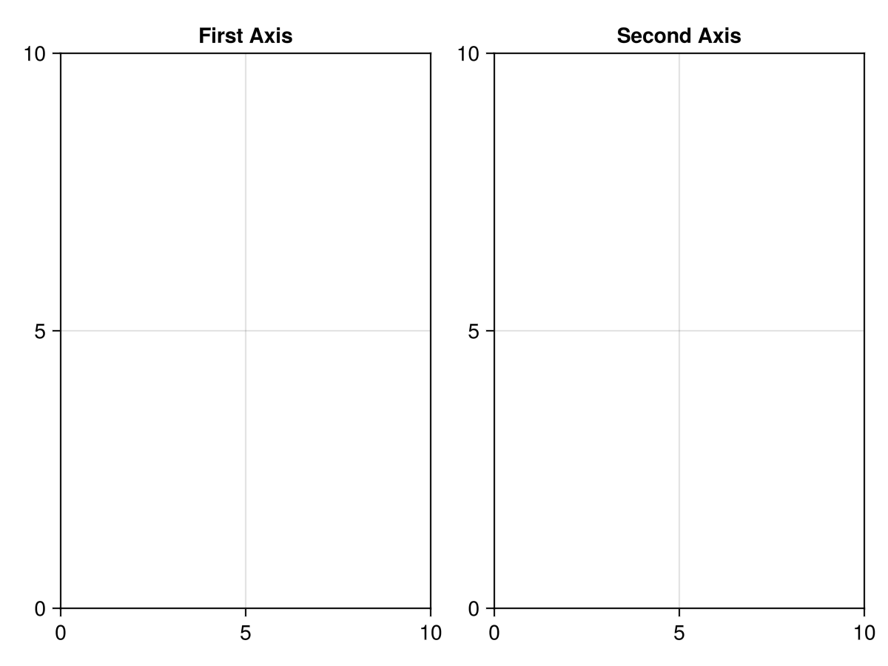

# Plotting

All of the tools we have used so far have been part of the Julia standard library.
In this lesson we will use an external package for the first time: a plotting library called [Makie.jl](https://makie.org).

Makie.jl is a powerful, modern plotting library that is easy to use and produces high-quality visualizations.
It has a GPU-accelerated backend for fast rendering and interactive plots, a static vector graphics backend for high-quality publication-ready plots, and a web-based backend for interactive plots in the browser.
 
Check out the official [Makie tutorials](https://docs.makie.org/stable/tutorials/getting-started) for examples and documentation.


## Before we start
Makie's [Getting Started](https://docs.makie.org/stable/tutorials/getting-started) tutorial is very well written and, honestly, I can't do much better for an introduction.
Before this lesson, please go through it on your own and ask questions if you run into trouble.

We already installed Makie in the first chapter, but here is a quick reminder.


### Install Makie
There are three backends for Makie for different use cases:
- **GLMakie:** a GPU-accelerated backend for fast rendering and interactive plots.
- **CairoMakie:** a static vector graphics backend for high-quality publication-ready plots.
- **WGLMakie:** a web-based backend for interactive plots in the browser.

You will select one of these depending on your needs.

Here we will use GLMakie, but you can also use CairoMakie.
Recall from Chapter 1 that you can install packages in Julia using the package manager.

1. Open your `tutorial` folder in VS Code.
2. Start the Julia REPL from the command palette (`cmd+shift+p` on macOS or `ctrl+shift+p` on Windows) by typing `Julia: Start REPL`.
2. In the REPL, type `]` to enter the package manager. (Hit backspace to exit the package manager and return to the Julia REPL.)
4. Type `add GLMakie` (or `add CairoMakie`) to install.

Before we start plotting, let's make a new folder called `plotting` or similar in your `tutorial` folder.
Then open the folder.

To use a package in Julia, you need to import it.
This is usually done at the top of the file like this:

```julia
using GLMakie  # or CairoMakie
```

Now let's make a simple plot.


## Make a basic plot

### Figures and Axes
In Makie, the `Figure` is the top-level container object.
An `Axis` is a container object for plots.
We can place one or more `Axis` objects in a `Figure` to create a layout.
Let's try this step by step in VS Code.

```julia
using GLMakie

f = Figure()
f
```

Hit `alt+enter` to run all of the code in this file. You should see a blank figure window pop up.
The code might run slow at first.
This is because Julia is a just-in-time (JIT) compiled language, meaning that it compiles code as you need it.
The first time you run the code, it will take a bit longer to run.
But subsequent runs will be much faster.

Think of a `Figure` as a blank canvas on which to place axes, plots, and labels.
Now let's add an `Axis` to the figure.

```julia
f = Figure()
ax = Axis(f[1, 1], title = "First Axis")
f
```


You can see that it takes up the entire figure.
Let's make another `Axis` in the first row and second column of the figure.

```julia
f = Figure()
ax = Axis(f[1, 1])
ax2 = Axis(f[1, 2])
f
```

The first axis resizes to accommodate the second axis.
An `Axis` can span multiple rows and columns.

```julia
f = Figure()
ax = Axis(f[1, 1])
ax2 = Axis(f[1, 2])
ax3 = Axis(f[2, 1:2])
f
```


These are just the basics of the powerful layout system in Makie.
For now, let's just create a single `Axis` in the figure and plot some data.


### Generate and plot noisy data
Let's first define a function: a damped sine wave as a function of time.

```julia
function damped_sine(t, A, f, τ)
    return A * exp(-t / τ) * sin(2π * f * t)
end
```

Then we will generate the data.
Start with the following values

```julia
A = 3.0  # amplitude
f = 1  # frequency in Hz
τ = 1  # decay time constant in picoseconds
```
Next we create linearly spaced time values in picoseconds, then generate the signal intensity values and store them in a variable called `intensity`.

```julia
ps = 1:0.1:5  # time in picoseconds
intensity = damped_sine.(t, A, f, τ)
```

Let's add a bit of noise to simulate experimental data.

```julia
noise = 0.1 * randn(length(ps))
intensity_noisy = intensity .+ noise
```

Now let's plot the data, add labels, styling and a legend.
Note that we can position the `axislegend` in the bottom right corner of the plot by setting the `position` keyword argument to `:rb`, which means "right bottom".

```julia
f = Figure()
ax = Axis(f[1, 1],
    title = "Damped sine wave",
    xlabel = "Time (ps)",
    ylabel = "Intensity",
)
scatter!(
    ps,
    intensity_noisy,
    color = :firebrick3
    label = "Data",
    )
lines!(
    ps,
    intensity,
    color = :deepskyblue4,
    linestyle = :dash,
    label = "f(x) = A exp(−t / τ) sin(2π f t)",
    )

axislegend(position = :rb)
f
```


If the plot comes after the `Axis` definition, it will be drawn on top of the `Axis` and you don't need to input the `ax` variable.
These are some colors that I like.
There is a full color palette at [Colors.jl](https://juliagraphics.github.io/Colors.jl/latest/namedcolors/).


## Programmatic plotting
Integrating programming concepts like loops and functions into plotting can be very powerful.
In this example, we will use a loop to plot multiple sine waves with different frequencies and amplitudes.
Let's again use the damped sine function we defined earlier.

Image we have three sets of data with different amplitudes, frequencies, and decay time constants.
We will generate random parameters for each data set.
In the following code, we use `rand(1:3, 3)` to generate three random integers between 1 and 3 for the amplitude, frequency, and decay time constant.
We want to plot them all on the same axis, but vertically offset each plot so that they don't overlap.
Let's set these parameters first and then create a loop to plot the data.
I have also use a higher resolution for the time values to make the sine waves smoother.

```julia
ps_hires = 1:0.02:5  # higher resolution time values

num_data_sets = 3
offset = 5  # vertical offset between data sets
noise_level = 0.1 

for i in 1:num_data_sets
    A, ω, τ = rand(1:3, 3)
    intensity = damped_sine.(ps, A, ω, τ) .+ noise_level * randn(length(ps))
    lines!(ps, intensity .+ (i - 1) * offset)
end
```

In each loop, the y-axis values are offset by `(i - 1) * offset`, which means the first data set will be plotted at y=0, the second at y=5, and the third at y=10.
Changing the `offset` variable will change the vertical spacing between the data sets.
This allows flexibility and also precision in plotting multiple data sets.

We can even add a different label for each data set.
Adding this and a few other styling options, we can make the plot look nice.

```julia
f = Figure()
ax = Axis(f[1, 1],
    title = "Time traces",
    xlabel = "Time (ps)",
    ylabel = "Intensity",
)

ps_hires = 0:0.02:5

num_data_sets = 3
offset = 5
noise_level = 0.1

for i in 1:num_data_sets
    A, ω, τ = rand(1:3, 3)
    intensity = damped_sine.(ps, A, ω, τ) .+ noise_level * randn(length(ps))
    lines!(ps, intensity .+ (i - 1) * offset, label = "Data set $i")
end

axislegend(ax)
f
```


## Navigating a plot

The following and more Axis interactions can be found in the [Makie documentation](https://docs.makie.org/stable/reference/blocks/axis#Axis-interaction).

### Zooming
You can zoom in and out of the plot by scrolling.
Holding `x` or `y` while scrolling will zoom in only on the x or y axis.
Click while holding the `ctrl` key to reset the zoom.

### Selecting a region
Click and drag to zoom in on a portion of the graph.
This can also be done in x or y direction by holding `x` or `y` while dragging.
Again, click while holding the `ctrl` key to reset the zoom.

### Panning
Right-click and drag to pan the plot.
Similar to zooming, you can hold `x` or `y` to pan only in that direction.
Click while holding the `ctrl` key to reset the pan.


## Commenting and working in sections in VS Code
By now you know that you can evaluate a single line of code by placing the cursor on the line and hitting `shift+enter`, and you can evaluate the entire file by pressing `alt+enter`.

It's common to also leave comments in the code to explain what the code does.
You can add comments by starting a line with `#` or by adding `#` at the end of a line.
A convenient way to comment out a line is to select the line and hit `cmd+/` (or `ctrl+/` on Windows).
Hit `cmd+/` (`ctrl+/`) again to uncomment the line.

Try this by changing the `markersize` to `10` toggling the comment keyboard shortcut.

```julia
scatter!(
    ps,
    intensity_noisy,
    color = :firebrick3
    label = "Data",
    # markersize = 10,
)
```

Sometimes you want to evaluate only a section of the code.
For example, you might want to evaluate the code that generates the data and the code that creates the plot separately.
You can separate chunks of code by adding `##` at the beginning of line.
Then hitting `alt+enter` will evaluate the code in that section (between two `##` lines, or from the beginning of the file to the first `##` or from the last `##` to the end of the file).
Try this by separating the code that generates the data and the code that creates the plot into two sections.


## Saving
You can save the plot to a file using the `save` function.

You can save the plot to a file using the `save` function.
Save this plot to a file called `damped_sine_wave.png` in a new folder called `output` in your tutorial folder.

```julia
save("output/damped_sine_wave.png", f)
```

Notice that the plot no longer appears in the window.
You can comment out the `save` line and evaluate again to see the plot.


## Problems
1. Visualize the potential of two point charges with surface plot in 3D.
You will need to look up the equation for the potential of a point charge in Cartesian coordinates and how to create a surface plot in Makie.

    The potential of a point charge in Cartesian coordinates is given by the equation:

    $$\phi(x, y) = \frac{q}{4\pi\epsilon_0} \left( \frac{1}{\sqrt{(x+a)^2+y^2}} - \frac{1}{\sqrt{(x-a)^2+y^2}} \right)$$

    where $q$ is the charge, $\epsilon_0$ is the permittivity of free space, and $a$ is the distance between the two charges.
    Place two charges, $+q$ and $-q$ on your plot at $(-a, 0)$ and $(+a, 0)$.
