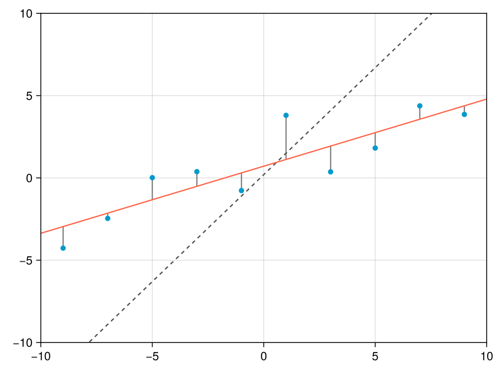
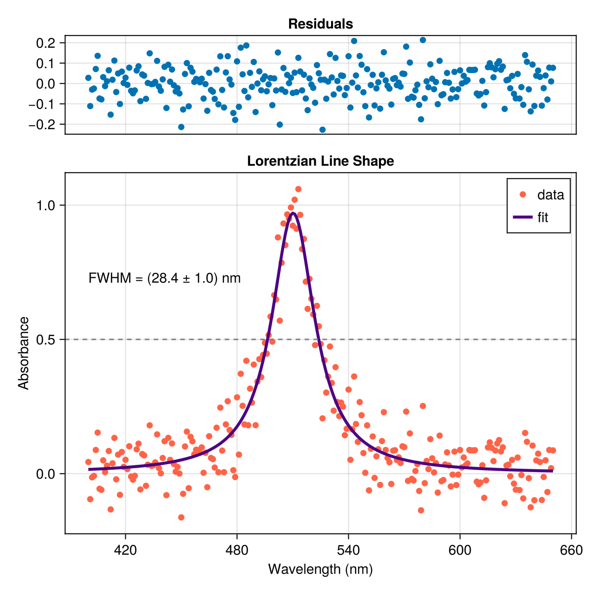

# Basic fitting

In this chapter we will discuss the basic principles of fitting a model to data using the [least squares method](https://en.wikipedia.org/wiki/Least_squares).
We will use the [LsqFit.jl](https://github.com/JuliaNLSolvers/LsqFit.jl) package to perform the fitting.


## Least squares fitting
You have some experimental data composed of $n$ pairs of data points $(x_i, y_i)$ where $i = 1, \dots, n$ and $y_i$ is the value that you observe at $x_i$.
You want to gain some physical insight into the data by seeing how well a model explains it and adjusting the model parameters until the model function "fits" the data as best it can.
For example, if you measure the absorbance for several samples of a liquid at various concentrations you expect there to be a linear relationship between the absorbance and the concentration (the famous Beer-Lambert Law).
The difference between the measured absorbance and the linear model is the error.
The slope and intercept of the line are the parameters to vary to find a line that best matches the data.

For whatever system you are studying, the parameters that produce a model that best fits the data hopefully say something useful about the physical system that you have measured.
Aside from choosing a physically suitable mode, we have to somehow quantify how well the model "fits" the data.
The model function takes the form $f(x, p)$, where $p$ is a vector of parameters that you want to uncover via the fitting process.
This vector of "best fit" parameters is what we are trying to find.
How well the model fits the data is measured by the difference between the observed values $y_i$ and the model values $f(x_i, p)$ for a given $p$.
The set of differences is called the residuals, and are defined by

$$r_i = y_i - f(x_i, p)$$

The least squares method then squares the residuals and sums them up.
Minimizing this sum of the squared residuals will return the optimal parameters values $p$.
The sum of the squared residuals is given by

$$
S = \sum_{i=1}^n r_i^2 = \sum_{i=1}^n \left(y_i - f(x_i, p) \right)^2
$$

This function is also known as the cost or [loss function](https://en.wikipedia.org/wiki/Loss_function). Sometimes it is also referred to as the error function.
There are many ways to minimize the cost function, but that is beyond the scope of this chapter.
(Plotting the loss function is a useful way to visualize how sensitive the model is to different parameters, but this is a topic for the next chapter on optimization.)

The example below shows a linear fit to randomly generated data, together with the residuals shown as lines between the data points and the fitted line.
The line representing the initial guess parameters is shown as a dashed line.




## Problem

Let's say you take a noisy spectrum of a sample and observe single peak around 500 nm. You have good reason to believe that the peak is Lorentzian in shape, a common line shape in spectroscopy.
A Lorentzian line shape is given by the equation

$$
L(x) = \frac{I_0}{1 + \left(\frac{x - x_0}{\Gamma / 2}\right)^2}
$$

where $I_0$ is the amplitude, $x_0$ is the center frequency (often expressed in wavenumbers) of the peak, and $\Gamma$ is the full width at half maximum (FWHM) occuring at points $x = x_0 \pm \frac{\Gamma}{2}$.

Go to the GitHub page for LsqFit.jl and follow the examples to use `curve_fit()` to fit a Lorentzian function with the following parameters:

```julia
A = 1.0
Γ = 28
x0 = 510
```

You should end up with something like below, depending on how many data points you create and how much noise you add to the data.
Remember to include an error estimate for each parameter.



It is useful to plot the residuals of the fit to see how well the results fit the data.
There should not be any systematic structure in the residuals.
If there is, then the model is not a good fit to the data.


## Resources

- Least Squares Fitting on [Wikipedia](https://en.wikipedia.org/wiki/Least_squares)
- [Khan Academy](https://www.khanacademy.org/math/ap-statistics/bivariate-data-ap/xfb5d8e68:residuals/v/regression-residual-intro) on residuals and least squares regression
- Ledvij, M. "[Curve Fitting Made Easy](http://physik.uibk.ac.at/hephy/muon/origin_curve_fitting_primer.pdf)." Industrial Physicist 9, 24-27, Apr./May 2003.
