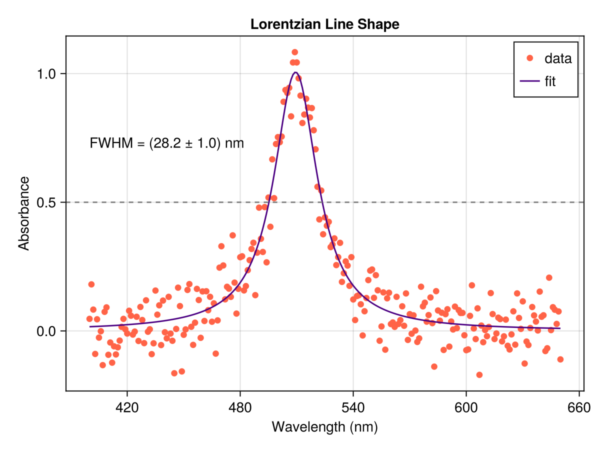

# Basic fitting

In this chapter we will discuss the basic principles of fitting data to a model using the [least squares method](https://en.wikipedia.org/wiki/Least_squares).
We will use the [LsqFit.jl](https://github.com/JuliaNLSolvers/LsqFit.jl) package to perform the fitting, which uses the Levenberg-Marquardt algorithm.

## Nonlinear least squares
You are a spectroscopist and you have taken a spectrum of a sample with $n$ pairs of data points $(x_i, y_i)$ where $i =1, ..., n$ and $y_i$ is the value that you observe at $x_i$.
You want to gain some physical insight into the spectrum by overlaying a model on the data and adjusting the model parameters until the curve fits as best it can.
The parameters of the model that best fit the data hopefully say something useful about the physical system that you have just measured.
The model function takes the form $f(x, p)$, where $p$ is a vector of parameters that you want to uncover via the fitting process.
This vector of "best fit" parameters is what we are trying to find.
How well the model fits the data is measured by the difference between the observed values $y_i$ and the model values $f(x_i, p)$.
The set of differences is called the residuals, and are defined by

$$r_i = y_i - f(x_i, p)$$

The least squares method then squares the residuals and sums them up.
Minimizing this sum of the squared residuals will return the optimal parameters values $p$.
The sum of the squared residuals is given by

$$
S = \sum_{i=1}^n r_i^2 = \sum_{i=1}^n (y_i - f(x_i, p))^2
$$

This function is also known as the [cost or loss function](https://en.wikipedia.org/wiki/Loss_function). Sometimes it is also referred to as the error function.
Plotting the loss function is a useful way to visualize how sensitive the model is to different parameters, but this is a topic for the next chapter on optimization.

Let's say you have good reason to believe that the peak is Lorentzian in shape.
(You must have some physical justification for any model you choose.)
A Lorentzian line shape is given by the equation

$$
L(x) = \frac{I_0}{1 + \left(\frac{x - x_0}{\Gamma / 2}\right)^2}
$$

where $I_0$ is the amplitude, $x_0$ is the center frequency (often expressed in wavenumbers) of the peak, and $\Gamma$ is the full width at half maximum (FWHM) occuring at points $x = x_0 \pm \frac{\Gamma}{2}$.

## Resources

- Least Squares Fitting on [Wolfram MathWorld](https://mathworld.wolfram.com/LeastSquaresFitting.html)
- [Khan Academy](https://www.khanacademy.org/math/ap-statistics/bivariate-data-ap/xfb5d8e68:residuals/v/regression-residual-intro) on residuals and least squares regression
- Ledvij, M. "[Curve Fitting Made Easy](http://physik.uibk.ac.at/hephy/muon/origin_curve_fitting_primer.pdf)." Industrial Physicist 9, 24-27, Apr./May 2003.
