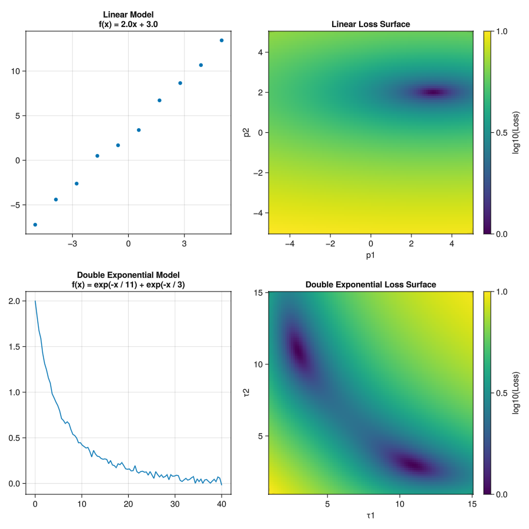
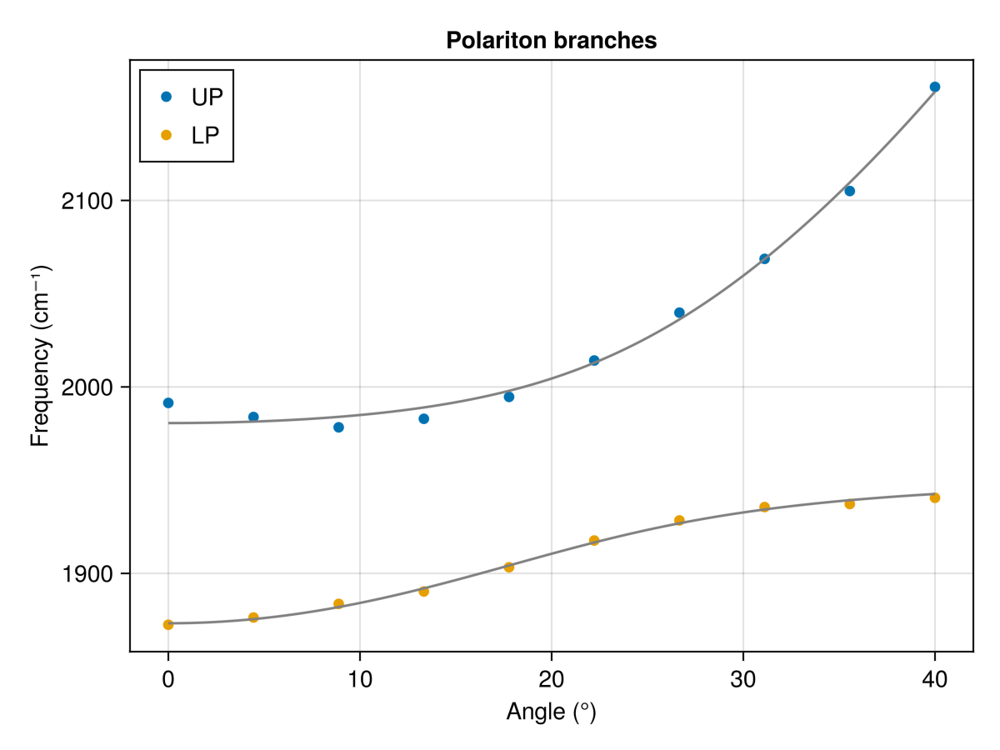

# Optimization

The fitting we did in the previous chapter is a simple example of optimization.
An optimization problem maximizes or minimizes an objective function by varying the input parameters.
With least squares fitting the objective function is the sum of the squared residuals, and this is then minimized.

It is often useful to visualize the loss function, which is the objective function plotted as a function of the parameters.
Below are two examples of the loss functions plotted as functions of parameters for a linear model $f(x) = p_1 x + p_2$ and a double exponential model $f(x) = e^{-x/\tau_1} + e^{-x/\tau_2}$.
Here, $p_1$ and $p_2$ are 2 and 3, respectively, and $\tau_1$ and $\tau_2$ are 11 and 3, respectively.
You can see that the loss function is a simple parabola for the linear model the minimum of the parabola occurs at the point (2, 3).
The double exponential loss surface has two wells, one at (11, 3) and the other at (3, 11) because it does not matter which of the two time constants is assigned to which parameter.
More complicated loss functions can have multiple wells, and the optimization algorithm may get stuck in a local minimum.
Thus the choice of optimization algorithm becomes important.




Later you will measure the Rabi splitting of a polariton system as a function of beam incidence angle.
There will be two peaks in the transmission spectrum, one corresponding to the upper polariton and the other to the lower polariton, that will change in frequency with angle.
If the two polariton peaks have the sample transmission amplitude,
then the Rabi splitting is the frequency difference between the two peaks.
Another way to extract the Rabi splitting is to measure
the angle-resolved spectrum, plot the frequency versus incidence angle, and fit the data to a simple coupled harmonic oscillator model, given by the Hamiltonian:

$$
H_\text{total} = 
\begin{pmatrix}
    \omega_c(\theta) & 0 \\
    0 & \omega_v
    \end{pmatrix}
    + \begin{pmatrix}
    0 & \Omega_R / 2 \\
    \Omega_R / 2 & 0
    \end{pmatrix}
    = \begin{pmatrix}
    \omega_c(\theta) & \Omega_R / 2 \\
    \Omega_R / 2 & \omega_v
\end{pmatrix}
$$

Diagonalizing the Hamiltonian gives the upper and lower polariton energies:

$$\omega_\pm(\theta) = \frac{1}{2}\left[ \omega_c(\theta) + \omega_v \pm \sqrt{\left(\omega_c(\theta) - \omega_v\right)^2 + \Omega_R^2}\right]$$

The molecular vibrational transition is $\omega_v$, and the Rabi splitting magnitude is $\Omega_R$. The cavity mode frequency $\omega_c$ is given by the equation

$$\omega_c(\theta) = \omega_c(0)\left(1 - \frac{\sin^2\theta}{n^2} \right)^{-1/2}$$

where $\theta$ is the beam angle with respect to the normal of the cavity surface and $n$ is the refractive index of the intracavity medium.

Let's first do this using the `LsqFit.jl` package and modify the model slightly to include both upper polariton and lower polariton curves.
First, we need to write a function for the upper and lower polariton energies. This is an exercise for you to do.
The function should take the parameters $\omega_c(0)$, $\omega_v$, $\Omega_R$, and $n$ as input, and return the upper and lower polariton frequencies as output. Then we use the polariton function to create a model function for fitting.





### Problems

1. Write a function to calculate the upper and lower polariton frequencies.

    ```julia
    using LsqFit

    function cavity_freqs(θ, ω_c_0, n)
        # Your code here
    end

    function polariton_freqs(θs, ...)
        # Your code here
    end

    function model(θs, p)
        E_v, E_0, n, Ω = p
        LP = polariton_freqs(θs, ...)
        UP = polariton_freqs(θs, ...)
        return vcat(LP, UP)
    end
    ```

    You will also need to write a function to calculate the cavity frequency as a function of angle. This equation is given above.
    In the function defining the fitting model, we have used a new function called `vcat()` to concatenate the two vectors of frequencies into a single vector.
    This way we can use the same fitting function for both the upper and lower polariton frequencies simultaneously.

    Then it's just a matter of organizing our data appropriately and calling the `curve_fit()` function.

    ```julia
    fit = curve_fit(model, θs, vcat(LP, UP), [E_v, E_0, n, Ω])
    ```
    Just as before, the parameters are passed as a vector in `fit.param`.
    If you plot you data and fitted curves, you should obtain something like the following.

2. Use the function to create data for the two polariton branches with gaussian noise and parameters $\omega_c(0)$ = 1900 cm<sup>-1</sup>, $\omega_v$ = 1950 cm<sup>-1</sup>, $\Omega_R$ = 60 cm<sup>-1</sup>, and $n$ = 1.4.

3. Use the `curve_fit()` function to fit the model to the data. Try different initial guesses for the parameters and see how they affect the fit.

4. Try changing the number of fitting parameters.
In the example above, we allowed four parameters to vary, but you can also fix some of them to known values.
Often the molecular vibrational mode is known, for example.
Remember to report the standard error on each parameter and the confidence intervals.
What do these quantities mean?


## More advanced optimization
The `LsqFit.jl` package only uses the Levenberg-Marquardt algorithm for optimization.
The Levenberg-Marquardt algorithm can be slow and may not converge to the global minimum, particularly in cases where the loss function has multiple wells.
Sometimes we need a different algorithm or more powerful optimization methods.
In these cases, it's usually necessary to define the loss function explicitly and use a more general optimization package.
There are several alternatives and the Julia ecosystem has become a rich source of modeling, equation solving, and optimization tools.
This page on [fitting a simulation to a dataset](https://docs.sciml.ai/Overview/stable/getting_started/fit_simulation/) provides a good example suitable for our lab.
