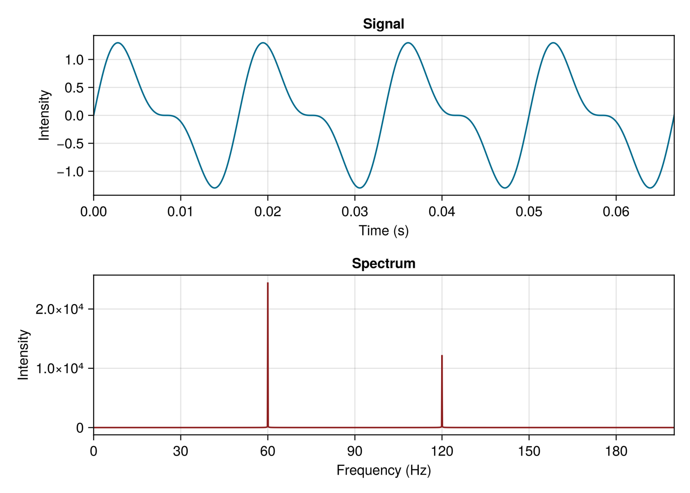
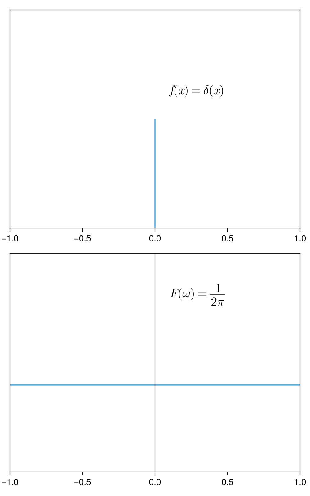

# Fourier transform and spectroscopy

Every signal has a spectrum that can be analyzed in the time domain or the frequency domain. Alternatively, you can measure in the spatial domain or spatial frequency domain. The Fourier transform is a mathematical operation that converts a signal from the time domain to the frequency domain.

We use the Fourier transform to analyze the optical response of materials. Sometime when measuring the time-dependent nonlinear response of a material oscillatory signatures appear. The frequency of these oscillations corresponds to coherences and couplings within the system.

We also often use a spectrometer called a Fourier transform infrared (FTIR) spectrometer. This instrument measures the interference pattern of light from a sample (called the interferogram) and uses the Fourier transform to convert the interference pattern into a spectrum.

A proper Fourier transform course would take many weeks to cover. Here we will only cover the basics to understand how to compute the Fourier transform in Julia and interpret the results.

## Two frequencies

Consider a sine wave at 60 Hz and its first harmonic at 120 Hz at half the amplitude of the fundamental frequency.
The time-domain signal may look complicated, as shown in the figure below, the Fourier transform of the signal will show two distinct peaks at 60 Hz and 120 Hz.
This simple example demonstrates the power of the Fourier transform to decompose a complex signal into its constituent frequencies, and we will use it to analyze much more complex signals arising from interactions between light and matter.



Let's implement this example in code.
First we import the required packages, GLMakie for visualization and FFTW for the Fourier transform
(FFTW.jl is just a wrapper for the FFTW library, the Fastest Fourier Transform in the West, written in C).
Then we define the signal function.

```julia
using FFTW
using GLMakie

signal(t, f1, f2) = sin(2π * f1 * t) + 0.5 * sin(2π * f2 * t)
```

Next we define the sample rate and generate the time vector.
The sample rate is the number of times per second we sample the signal.
Here we will define the inverse of the sample rate to be the time spacing between samples.
Half of the sample rate is called the Nyquist frequency, which is the highest frequency that can be accurately represented.
If you sample a signal at a rate less than twice the highest frequency, you will get aliasing, which is when the signal appears to be at a lower frequency than it actually is.
I encourage you to try sampling the signal at a lower rate and see what happens.

```julia
fs = 1000 # sample rate in Hz
t_max = 1 # max time in seconds
t = 0:1/fs:t_max

f1 = 60 # frequency in Hz
f2 = 120 # frequency in Hz
y = signal.(t, f1, f2)
```

Now we can compute the Fourier transform of the signal with the following code.

```julia
Y = abs.(fftshift(fft(y)))
X = fftshift(fftfreq(length(t), fs))
```

Once you successfully plot the signal and its Fourier transform let's consider what the three functions &mdash; `fft`, `fftshift`, and `fftfreq` &mdash; in the code do.

The function `fft` computes the discrete Fourier transform (DFT) of the signal in a way that is computationally efficient.
The result is a complex array, which is why we take the absolute value of the result to get the amplitude spectrum.

The function `fftfreq` computes the frequencies corresponding to the Fourier transform based on the window size `n = length(t)` (the length of the time vector) and the sample spacing `fs`.
It returns the positive frequencies first, then the negative frequencies.
The Fourier transform is symmetric about 0; it is defined on the interval (-∞, ∞).
Therefore, the second half of the Fourier transform is just a mirror image of the first half.
The function `fftshift` moves the zero frequency component to the center of the spectrum to make it easier to visualize.
Examples for `fftfreq` can be found by typing `?fftfreq` in the Julia REPL or hovering over the function name in VS Code.
Likewise, `fft` also requires shifting to the center of the spectrum.

We can see what `fftshift` does by acting it on the numbers one through ten.

```julia
julia> fftshift(1:10)
10-element Vector{Int64}:
  6
  7
  8
  9
 10
  1
  2
  3
  4
  5
```

You can see that it just swaps the first half of the array with the second half.
Try plotting the Fourier transform of the signal with and without using `fftshift` and see how it looks.


### Problems

Recall that the delta function $\delta(x)$ is a curious function with the following properties

$$\delta(x) =
\begin{cases}
    0, &x \ne 0, \\
    \infty, &x = 0,
\end{cases}$$

and

$$\int_{-\infty}^{\infty} \delta(x) dx = 1.$$


The Dirac delta function is actually a distrubution, not a function,
and distributions are defined by their integration properties or actions on test functions.
For a function $f(x)$ that is continuous at $x = 0$, the delta function has the property

$$\int_{-\infty}^{\infty} f(x) \delta(x) dx = f(0),$$

and if it is continuous at $x = a$, then

$$\int_{-\infty}^{\infty} \delta(x - a) f(x) dx = \int_{-\infty}^{\infty} \delta(a - x) f(x) dx = f(a).$$

Then, the Fourier transform of $\delta(x - a)$ is

$$\int_{-\infty}^{\infty} \delta(x - a) e^{-i x \xi} dx = e^{-i a \xi}.$$

1. Using the definition of the Dirac delta compute the following:

$$\frac{1}{2} \int_{-\infty}^{\infty} [\delta(x + a) + \delta(x - a)] e^{-ix\xi}dx$$

2. Write down the equation for a damped oscillator in terms of a temporal decay constant and an oscillation frequency and then implement it in code. Then compute its Fourier transform. Plot both curves. What happens to both the time-domain curve and its transform when you change the decay constant?

I have given you code the implements a square wave and it's Fourier transform. From the code, answer the following questions. **DO NOT RUN THE CODE YET!!** Just read it.

3. What is the frequency of the square wave?
4. How many harmonics are present in the Fourier transform and what are their frequencies?
5. What is the frequency resolution?
6. What is the Nyquist frequency of the given code? After which harmonic does it occur? In other words, what is the highest frequency that can be accurately represented?

Now **run the code** and answer the following questions.

7. Increase the number of harmonics and see what happens to the Fourier transform. What do you observe? Now decrease the number of points (thus decreasing the Nyquist frequency). What do you observe?


The photosynthetic light harvesting antennas in proteins are known to have electronic coherences, which are notoriously difficult to measure because of the noisiness of biological environments. The paper used in this problem measures long-lived coherences between excitons and molecular vibrations in coupled chromophores.
The following problem uses raw data from Figure 2d in the paper.
The raw data and basic code are provided.
You will perform analysis to extract the lifetime and frequency of the oscillations.


Zhu, *et al*. Quantum Phase Synchronization via Exciton-Vibrational Energy Dissipation Sustains Long-Lived Coherence in Photosynthetic Antennas. Nat Commun 2024, 15 (1), 3171. https://doi.org/10.1038/s41467-024-47560-6.

8. Using a single exponential decay function, fit the data to extract the energy relaxation time. Plot the data and the fit.

9. Now subtract the fit from the data and compute the Fourier transform of the residuals. Plot the Fourier transform and identify the oscillation frequency. What is the physical meaning of this frequency?