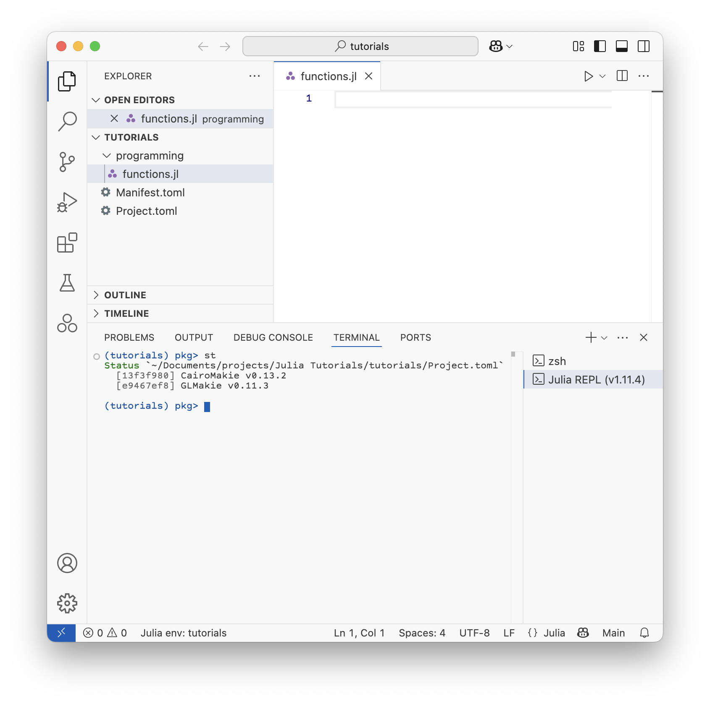

# Files, folders, and environments

The concept of files and folders are reviewed and then a tour of Visual Studio Code is given.
Students create a project folder to store their tutorial files and future experiment code.
This ensures consistent data storage and analysis practices in the lab.
We also cover environments and how to create a new environment for each project.
This is important for reproducibility and to avoid package conflicts.

## Files and folders on a computer
On a computer, files are stored in folders (directories), where a folder can contain both files and other folders.
We want to store files and folders in a way that makes it easy to find and organize them.
It is important in science to have well-organized data and code for reproducibility.

Follow these steps to create a project folder for your tutorials and experiments:

1. On macOS, go to `~/Documents/` and create a new folder called `projects`. On Windows go to `C:\Users\<username>\Documents\` and create a new folder called `projects`. This is where you will store your projects while you are in the lab.

2. Inside of `projects`, create a new folder called `tutorials`. This is where you will store code for these tutorials.

3. Open Visual Studio Code and open the `tutorials` folder that you just created.

4. Click on the new folder icon and make a new folder called `programming` or something similar.

5. Create a new file called `functions.jl` in the `programming` folder you just created. This is where you will write your code for this lesson (on functions).

Please continue to use this tutorials folder for you analysis when you do experiments in later tutorials (by creating an `FTIR` folder for the FTIR lesson, for example). Next we will create a new environment for these lessons.

## Environments
In Julia, an environment is a collection of packages and their versions that are used for a specific project.
This is important for reproducibility and to avoid package conflicts.
The packages you use in these tutorials might be different from your experiments.
Also, loading lots of packages can slow down compilation.

First look in the bottom left corner of the Visual Studio Code window.
Notice that it say "Julia env: v1.11" or something similar.
This means that you are using the default Julia environment, which is the global environment.
In general, we don't want to use the global environment for our projects.
Sometimes I use the global environment for quick tests, but I always create a new environment for my projects.

To create a new environment, follow these steps:
1. Open the Julia REPL in Visual Studio Code via the Command Palette (Ctrl+Shift+P) and find `Julia: Start REPL`.
2. In the REPL, type `]` to enter the package manager. (Hit backspace to exit the package manager and return to the Julia REPL.)
Notice that here too, it says `(@v1.11) pkg>` or something similar, indicating that you are in the global environment.
3. Type `activate .` to create a new environment in the current folder.
Now it says `(tutorials) pkg>`, indicating that you are in the new environment.
4. Now let's add the plotting package that we will use later, `GLMakie` and `CairoMakie`. I will explain what these are when we start to use them.

Notice that a `Project.toml` file and a `Manifest.toml` file were created in your project folder.
These files contain information about the packages and their versions that are used in this environment.
This is how Julia keeps track of the exact versions of the packages you are using and ensures that your code will work in the future.
If you close and reopen VS Code, the environment indicator in the lower left will say "Julia env: tutorials".

When Makie and its dependencies have finished installing and compiling, let's go back to the REPL by hitting backspace and learn about functions.

Below is what the student environment and file structure should look like after setup.
